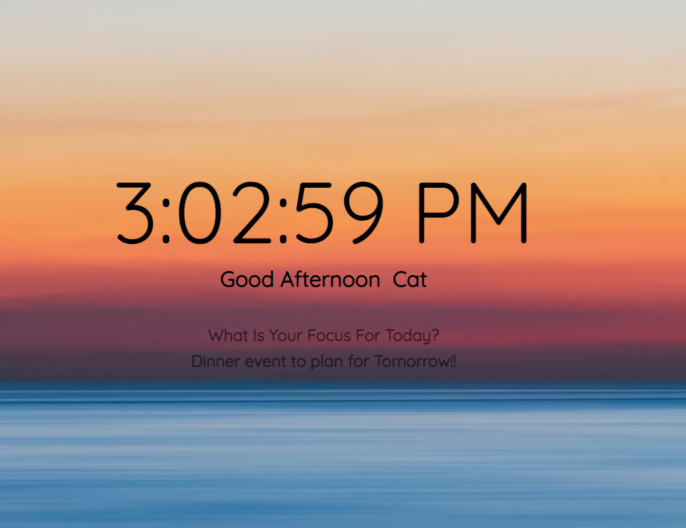

Dynamic Landing Page
--------------------
- Using vanilla javascript to make a device landing page.
- Real time is displayed
- Along with morning, afternoon or evening background image which changes depending upon time of day.
- Input for user to personalise with their name and option to change it.
- A second input allows the user to add a personalised 'focus' or mantra of the day - just for some inspiration!

- code handles DOM elements, time, images, event listeners, keypress functions.
- Optimized for desktop, tablet or phone application.

Here is a screenshot of the afternoon screen.

